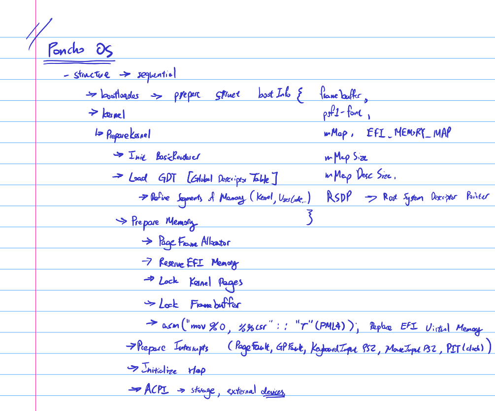

# PonchoOS Tutorial

  

### Notes
#### Poncho OS (sequential)
- bootloader -> prepare struct bootInfo
- kernel
    - prepareKernel
        - BasicRenderer
        - GDT //Global Descriptor Table (sections of memory)
        - Prepare memory
            - PageFrameAllocator
            - Reserve EFI Memory
            - Lock Kernel Pages
            - Lock Framebuffer
            - replace EFI Virtual Memory (Page Map?)
        - Prepare interrupts
        - initialize heap (w/ page map)
        - Handle ACPI (devices)

#### bootInfo
```{cpp}
struct bootInfo {
    framebuffer,
    psf1-font,
    EFI_MEMORY_MAP mMap,
    mMapSize,
    mMapDescSize,
    RSDP, //Root System Descriptor Pointer
}
```

### Structure
|folder|sub-folder|what's inside|
|---    |---    |---|
|sys    |boot   |- kernelUtil<br/>- gdt<br/>- efiMemory
|       |memory |- memory<br/>- heap<br/>- paging<br/>- PageFrameAllocator<br/>- PageMapIndexer<br/>- PageTableManager
|       |storage|- ahci<br/>- 
|       |time   |- pit
|       |interrupts|- IDT<br/>- interrupts<br/>- panic<br/>
|       |devices|- apci<br/>- IO<br/>- pci<br/>- pciDescriptors
|userinput|     |- kbScancodeTranslation<br/>- keyboard<br/>- mouse<br/>
|inc    |       |- Bitmap<br/>- cstr<br/>- math<br/>
|graphics|      |- BasicRenderer<br/>- Framebuffer<br/>- simpleFonts
|       |       |- kernel.cpp<br/>


